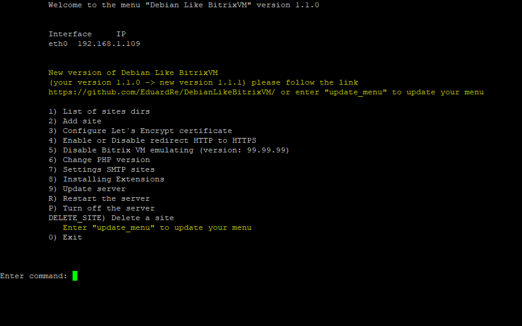

# Главное меню

# Информация
Это меню похожее на то, что было у Bitrix VM, но не для CentOS систем, а для Debian 12 (возможно, что будет работать и на 11 версии - я не тестировал). За основу был взят этот репозиторий [(YogSottot) bitrix-gt](https://github.com/YogSottot/bitrix-gt).

Проект пока находится в стадии разработке и тестирования

# Установка
### !!! ВНИМАНИЕ тестирования, поэтому будьте крайне осторожны на рабочих серверах, что-то может не работать или работать не так !!!

### Установку выполнять от root пользователя

Установка представлена в 2-х типах. Можно установить чисто меню, если уже установлено окружение с этого [(YogSottot) bitrix-gt](https://github.com/YogSottot/bitrix-gt) или этого (сделал форк) [(EduardRe) bitrix-gt](https://github.com/EduardRe/bitrix-gt) репозитория, или же можно установить все одной командой - это второй тип установки

1. Тип - используйте, если надо установить чисто меню (сервак уже должен быть настроен, через репозиторий или в ручную, но по аналогии - описано все выше). 
Установка используя CURL 
`bash <(curl -sL https://raw.githubusercontent.com/EduardRe/DebianLikeBitrixVM/master/install_menu.sh)`. 
Установка используя WGET 
`bash <(wget -qO- https://raw.githubusercontent.com/EduardRe/DebianLikeBitrixVM/master/install_menu.sh)`.
2. Тип - эта полная установка всего - предпочтительнее использовать именно ее. 
Установка используя CURL 
`bash <(curl -sL https://raw.githubusercontent.com/EduardRe/DebianLikeBitrixVM/master/install_full_environment.sh)`. 
Установка используя WGET 
`bash <(wget -qO- https://raw.githubusercontent.com/EduardRe/DebianLikeBitrixVM/master/install_full_environment.sh)`

# Обновление меню
Если вышла новая версия меню и вы хотите обновится - это также можно сделать одной командой `update_menu` или через запуск скрипта через CURL или WGET, также текущая версия меню будет забекаплена и сохранена в директории `/root/backup_vm_menu/ДЕНЬ.МЕСЯЦ.ГОД ЧАСЫ:МИНУТЫ:СЕКУНДЫ` пример `/root/backup_vm_menu/07.07.2024 09:29:45` 
Команды для обновления: 
Обновления используя CURL 
`bash <(curl -sL https://raw.githubusercontent.com/EduardRe/DebianLikeBitrixVM/master/update_menu.sh)`. 
Обновления используя WGET 
`bash <(wget -qO- https://raw.githubusercontent.com/EduardRe/DebianLikeBitrixVM/master/update_menu.sh)`

# Использование
Установка меню производиться в директорию `/root`, а точнее в `/root/vm_menu` и создается символическая ссылка `/root/menu.sh`, которая ведет на файл `/root/vm_menu/menu.sh` - это было сделано для удобства, что бы можно было использовать как раньше `./menu.sh` - если находитесь в директории `/root` или `/root/menu.sh`, если находитесь в другой директории, также можно использовать полный путь `/root/vm_menu/menu.sh`. Также после установки в файл `/root/.profile` прописывается путь к скрипту с меню, что позволяет загружать меню автоматически при подключении по SSH.

# Настройки
Скрипты написаны очень гибко и можно менять практически все - файл с настройками находиться здесь `/root/vm_menu/bash_scripts/config.sh` - по умолчанию там все настроено, но если что-то надо поправить под ваши нужды, то это можно сделать в этом скрипте.

# Новые возможности

Также предусмотрен функционал информирования о том, что вышла новая версия меню, обновление происходит через скрипт (описание выше) или вы можете вбить команду `update_menu`. Также вы можете использовать этот скрипт или команду `update_menu`, если вы экспериментировали с меню и что-то сломали - просто запустите его и он восстановит исходную версию.

# Поддержка, вопросы, предложения
[https://t.me/DebianLikeBitrixVM](https://t.me/DebianLikeBitrixVM)

