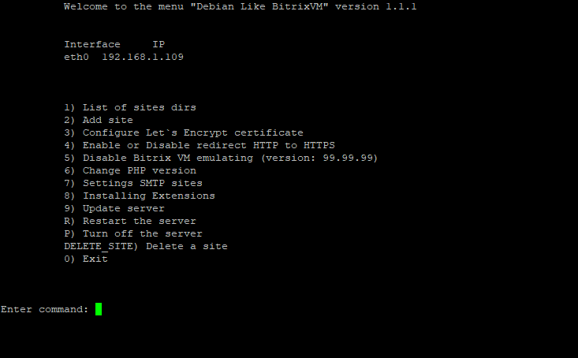

# Главное меню


# Информация
Это меню похожее на то, что было у Bitrix VM, но не для CentOS систем, а для Debian 12 (возможно, что будет работать и на 11 версии - я не тестировал). За основу был взят этот репозиторий [(YogSottot) bitrix-gt](https://github.com/YogSottot/bitrix-gt).

Проект пока находится в стадии тестирования

# Возможности окружения
- При установки окружения устанавливается все необходимое, а также устанавливается и настраивается Push and Pool сервер
- Поддержка композита из коробки
- Отдача статики через Brotli из коробки
- Гибко применять свои конфиги для Nginx не меняя стандартные конфиги

# Возможности меню
- Показывать список сайтов
- Создавать сайты, как полноценные, так и на символических ссылках
- Удаление сайтов, как полноценных, так и на символических ссылках 
- При создании полноценного сайта агенты автоматически переводятся на CRON
- Выпускать SSL Let`s Encrypt сертификаты
- Включать и выключать редирект с HTTP на HTTPS протокол
- Эмулировать версию Битрикс ВМ (нужно для порталов Битрикс 24, что бы при проверки не было ошибки, что портал работает не в битрикс ВМ)
- Изменение версий PHP
- Настройка SMTP как по умолчанию, так и для каждого сайта по отдельности
- Обновление сервера
- Перезагрузка сервера
- Выключение сервера
- Возможность установки полнотекстового поиска Sphinx
- Возможность установки мониторинга Netdata
- Информирование о выходе новой версии меню
- Возможность обновить меню одной командой `update_menu`

## Краткий видео обзор:
[](https://www.youtube.com/watch?v=W8SrohS-l0o)

# Установка
### !!! ВНИМАНИЕ Проект находится на стадии тестирования, поэтому будьте крайне осторожны на рабочих серверах, что-то может не работать или работать не так !!!

### Установку выполнять только от root пользователя и использовать меню тоже только от root пользователя.
#### Полная установка окружения. Очень желательно устанавливать на чистый Debian 12 и выше<br>
Установка используя CURL<br>
`bash <(curl -sL https://raw.githubusercontent.com/EduardRe/DebianLikeBitrixVM/master/install_full_environment.sh)`.<br>
Установка используя WGET<br>
`bash <(wget -qO- https://raw.githubusercontent.com/EduardRe/DebianLikeBitrixVM/master/install_full_environment.sh)`

# Обновление меню
Если вышла новая версия меню и вы хотите обновится - это также можно сделать одной командой `update_menu` или через запуск скрипта через CURL или WGET, также текущая версия меню будет забекаплена и сохранена в директории `/root/backup_vm_menu/ДЕНЬ.МЕСЯЦ.ГОД ЧАСЫ:МИНУТЫ:СЕКУНДЫ` пример `/root/backup_vm_menu/07.07.2024 09:29:45`<br>
Команды для обновления:<br>
Обновления используя CURL<br>
`bash <(curl -sL https://raw.githubusercontent.com/EduardRe/DebianLikeBitrixVM/master/update_menu.sh)`.<br>
Обновления используя WGET<br>
`bash <(wget -qO- https://raw.githubusercontent.com/EduardRe/DebianLikeBitrixVM/master/update_menu.sh)`


# Использование
Установка меню производиться в директорию `/root`, а точнее в `/root/vm_menu` и создается символическая ссылка `/root/menu.sh`, которая ведет на файл `/root/vm_menu/menu.sh` - это было сделано для удобства, что бы можно было использовать как раньше `./menu.sh` - если находитесь в директории `/root` или `/root/menu.sh`, если находитесь в другой директории, также можно использовать полный путь `/root/vm_menu/menu.sh`. Также после установки в файл `/root/.profile` прописывается путь к скрипту с меню, что позволяет загружать меню автоматически при подключении по SSH.

# Настройки
Скрипты написаны очень гибко и можно менять практически все - файл с настройками находиться здесь `/root/vm_menu/bash_scripts/config.sh` - по умолчанию там все настроено, но если что-то надо поправить под ваши нужды, то это можно сделать в этом скрипте.

# Новые возможности


Также предусмотрен функционал информирования о том, что вышла новая версия меню, обновление происходит через скрипт (описание выше) или вы можете вбить команду `update_menu`. Также вы можете использовать этот скрипт или команду `update_menu`, если вы экспериментировали с меню и что-то сломали - просто запустите его и он восстановит исходную версию.

# Донат: Отблагодарить автора
Отблагодарить автора можно по этим реквизитам:<br>
Т-Банк (Тинькофф):
```2200700453633884```

Сбербанк:
```2202202392509430```

ВТБ:
```2200240274990312```

# Поддержка, вопросы, предложения
[https://t.me/DebianLikeBitrixVM](https://t.me/DebianLikeBitrixVM)

